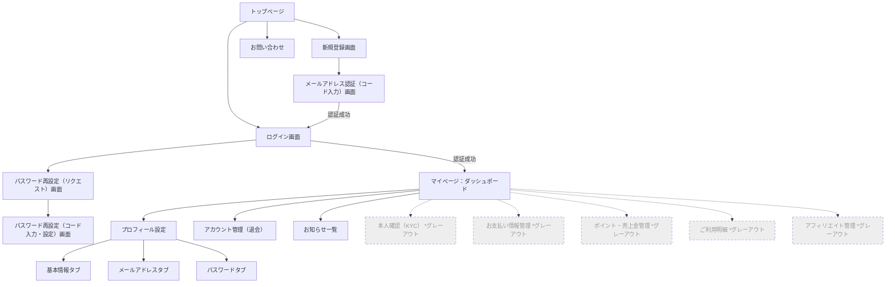

# netherid 画面設計書（画面遷移・配置項目）

## 1. 画面遷移図



---

## 2. ディレクトリ構成

```
frontend/
├── index.html                     # トップページ（LP）
├── script.js
├── common.js                      # 共通ユーティリティ・API関数
├── design-system/
│   ├── index.html                 # デザインシステムガイド（開発用）
│   └── style.css                  # デザイントークン・共通コンポーネント
├── auth/
│   ├── login/index.html           # ログイン
│   ├── register/index.html        # 新規登録
│   ├── verify/index.html          # メールアドレス認証（コード入力）
│   └── recovery/
│       ├── index.html             # パスワード再設定リクエスト
│       └── reset/index.html       # パスワード再設定（コード入力・新PW設定）
├── mypage/
│   ├── index.html                 # ダッシュボード
│   ├── profile/index.html         # プロフィール設定
│   └── account/index.html         # アカウント管理（退会）
├── contact/
│   └── index.html                 # お問い合わせ
└── notification/
    └── index.html                 # お知らせ一覧
```

---

## 3. 各画面の配置項目一覧

### 共通コンポーネント

| 区分 | ヘッダー | フッター | サイドバー |
|------|---------|---------|---------|
| 未ログイン（LP・認証画面）| ロゴ、「ログイン」「新規登録」ボタン | 規約・ヘルプリンク | なし |
| ログイン後（マイページ系） | ロゴ、お知らせアイコン（通知ドロップダウン）、ユーザーアイコン（アカウントメニュー） | なし | ナビゲーション（後述） |

**ログイン後サイドバーナビゲーション:**
- ダッシュボード
- プロフィール設定
- ヘルプ（外部リンク）
- アカウント管理（退会）
- ログアウト
- グレーアウト項目（KYC / お支払い / ポイント / 明細 / アフィリエイト）

---

### 3.1. パブリック画面（未ログイン）

#### 1. トップページ（LP）`/`

| エリア | 内容 |
|--------|------|
| ヘッダー（未ログイン時） | ロゴ、「ログイン」ボタン、「新規登録」ボタン |
| ヘッダー（ログイン時） | ロゴ、お知らせドロップダウン、ユーザーアカウントメニュー |
| ヒーローセクション | ブランド名・キャッチコピー、登録誘導ボタン |
| サービス一覧 | APIから取得したサービスカードグリッド（SSO遷移先） |
| お知らせセクション | APIから取得した最新5件のお知らせ一覧 |
| フッター | 運営会社情報、利用規約、プライバシーポリシー、特定商取引法に基づく表記、お問い合わせ、ヘルプリンク |
| モバイル | ハンバーガーメニュー（オーバーレイ） |

**API連携:**
- `GET /notifications` - お知らせ取得
- `GET /services` - サービス一覧取得
- `GET /sessions/whoami`（サイレント） - ログイン状態確認

---

#### 2. 新規登録画面群

**登録入力画面** `/auth/register/`

| 項目 | 内容 |
|------|------|
| メールアドレス | 入力フォーム |
| パスワード | 入力フォーム（目アイコンで表示/非表示切り替え） |
| 氏名 | 入力フォーム |
| 利用規約同意 | チェックボックス（利用規約・プライバシーポリシーへのリンク付き） |
| 送信ボタン | 「登録して認証コードを送信」 |
| エラー表示 | Kratosエラーメッセージを日本語で表示 |
| ページ下部リンク | 「ログインはこちら」 |

**メールアドレス認証画面** `/auth/verify/`

| 項目 | 内容 |
|------|------|
| 認証コード入力 | 6桁の個別入力ボックスUI（自動フォーカス移動・貼り付け対応） |
| 送信先メール表示 | 入力されたメールアドレスを表示 |
| 送信ボタン | 「認証して完了する」 |
| 再送リンク | 「認証コードを再送する」 |
| エラー・案内表示 | アラートコンポーネント |

---

#### 3. ログイン画面 `/auth/login/`

| 項目 | 内容 |
|------|------|
| メールアドレス | 入力フォーム |
| パスワード | 入力フォーム（目アイコンで表示/非表示切り替え） |
| ログインボタン | 「ログイン」 |
| リンク | 「パスワードをお忘れの方はこちら」 |
| エラー表示 | Kratosエラーメッセージを日本語で表示 |
| 成功メッセージ | URLパラメータ（`?verified=1`, `?reset=1`）に応じて表示 |

---

#### 4. パスワード再設定画面（リカバリフロー）

**リクエスト画面** `/auth/recovery/`

| 項目 | 内容 |
|------|------|
| メールアドレス入力 | 登録済みメールアドレス |
| 送信ボタン | 「リカバリコードを送信」 |
| 案内アラート | 手順説明テキスト |

**コード入力・再設定画面** `/auth/recovery/reset/`

| 項目 | 内容 |
|------|------|
| リカバリコード入力 | 6桁の個別入力ボックスUI |
| コード検証ステップ | コード検証後に新パスワード入力欄を表示（2ステップUI） |
| 新しいパスワード | 入力フォーム（目アイコンで表示/非表示切り替え） |
| パスワード強度インジケーター | 5段階バー表示 |
| 確認用パスワード | 入力フォーム |
| 送信ボタン | 「パスワードを再設定する」 |

---

### 3.2. マイページ（ログイン後）

#### 1. ダッシュボード `/mypage/`

| エリア | 内容 |
|--------|------|
| ウェルカムバナー | 「〇〇さん、こんにちは」（氏名優先、未設定時はメール表示） |
| サービス一覧 | 利用可能なサービスカードグリッド（SSO遷移リンク）、未公開サービスは「Coming Soon」バッジ |
| お知らせセクション | カテゴリフィルタタブ（すべて / subsuku / lunchmap）、APIから取得した通知リスト |

**API連携:**
- `GET /sessions/whoami` - ユーザー名取得
- `GET /notifications` - お知らせ取得
- `GET /services` - サービス一覧取得

---

#### 2. プロフィール設定 `/mypage/profile/`

3タブ構成のページ。

**タブ1: 基本情報**

| 項目 | 内容 |
|------|------|
| 氏名 | テキスト入力フォーム |
| 郵便番号 | 数値入力フォーム、「住所を自動入力」ボタン |
| 都道府県 | テキスト入力フォーム（郵便番号から自動補完） |
| 市区町村 | テキスト入力フォーム（郵便番号から自動補完） |
| 番地 | テキスト入力フォーム |
| 建物名・部屋番号 | テキスト入力フォーム |
| 保存ボタン | 「変更を保存する」 |

**タブ2: メールアドレス**

| 項目 | 内容 |
|------|------|
| 現在のメールアドレス | 読み取り専用表示 |
| 新しいメールアドレス | 入力フォーム |
| 変更ボタン | 「メールアドレスを変更する」 |

**タブ3: パスワード**

| 項目 | 内容 |
|------|------|
| 現在のパスワード | 入力フォーム（目アイコンで表示/非表示切り替え） |
| 新しいパスワード | 入力フォーム |
| パスワード強度インジケーター | 5段階バー表示 |
| 確認用パスワード | 入力フォーム |
| 変更ボタン | 「パスワードを変更する」 |

---

#### 3. アカウント管理（退会） `/mypage/account/`

| エリア | 内容 |
|--------|------|
| ポイント・売上金サマリー | 退会前の残高確認表示 |
| 退会ボタン | 「退会手続きへ進む」 |
| **確認モーダル** | |
| - メール入力 | 登録メールアドレスの入力（本人確認） |
| - 警告アラート | 「一度削除すると元に戻せません」等の注意事項 |
| - キャンセルボタン | モーダルを閉じる |
| - 確定ボタン | 「退会する」（メール一致確認後に有効化） |
| ブロック理由表示 | APIでブロック状態が返却された場合に理由を表示 |

---

#### 4. お知らせ一覧 `/notification/`

| エリア | 内容 |
|--------|------|
| フィルタタブ | すべて / subsuku / lunchmap |
| 通知リスト | 日付、サービスバッジ、タイトルの行一覧 |
| 空状態 | 該当するお知らせがない場合のメッセージ |
| **詳細モーダル** | 行クリックで表示 |
| - サービスバッジ | サービス種別を示すバッジ |
| - カテゴリバッジ | 通知カテゴリを示すバッジ |
| - 日付 | 通知日時 |
| - タイトル・本文 | リッチテキスト（HTML）対応 |
| - 閉じるボタン | オーバーレイクリック・ESCキーでも閉じる |

**API連携:**
- `GET /notifications` - お知らせ一覧取得

---

#### 5. お問い合わせ `/contact/`

2タブ構成のページ。

**タブ1: 新規お問い合わせ**

| 項目 | 内容 |
|------|------|
| サービス選択 | セレクトボックス（nether-id / subsuku / lunchmap / その他） |
| 件名 | テキスト入力フォーム |
| 本文 | テキストエリア |
| 送信ボタン | 「送信する」 |
| バリデーション | 各フィールドのエラーメッセージ表示 |

**タブ2: お問い合わせ履歴**

| 項目 | 内容 |
|------|------|
| テーブル | 日時、サービス、件名、ステータスの一覧 |
| ステータスバッジ | 対応状況を色分け表示 |
| 空状態 | 「まだお問い合わせはありません」アイコン＋テキスト |

**API連携:**
- `POST /inquiries` - お問い合わせ送信（セッション情報からメール自動設定）
- `GET /inquiries` - お問い合わせ履歴取得（タブ切り替え時に遅延ロード）

---

### 3.3. グレーアウト対象画面（現段階ではサイドバー上に非活性で表示するのみ）

| 画面 | 将来の配置予定内容 |
|------|-----------------|
| 本人確認（KYC） | 身分証・登記簿等の画像アップロードフォーム、審査ステータス表示 |
| お支払い情報管理 | 登録済みクレジットカード一覧、カード追加フォーム、メインカード指定 |
| ポイント・売上金管理 | ポイント残高表示、チャージボタン、増減履歴テーブル |
| ご利用明細 | 決済履歴テーブル（日付・金額・内容）、請求書PDF・領収書PDFダウンロード |
| アフィリエイト管理 | 紹介用URLの発行、成果発生履歴テーブル、振込先口座設定フォーム |

---

## 4. API連携一覧

| エンドポイント | メソッド | 用途 | 認証 |
|--------------|---------|------|------|
| `/notifications` | GET | お知らせ一覧取得 | 任意 |
| `/services` | GET | サービス一覧取得 | 任意 |
| `/inquiries` | POST | お問い合わせ送信 | 必須 |
| `/inquiries` | GET | お問い合わせ履歴取得 | 必須 |
| `/sessions/whoami` | GET | ログイン中ユーザー情報取得（Kratos） | Cookie |
| `/self-service/login/browser` | GET | ログインフロー初期化（Kratos） | - |
| `/self-service/login` | POST | ログイン送信（Kratos） | フローID |
| `/self-service/registration/browser` | GET | 登録フロー初期化（Kratos） | - |
| `/self-service/registration` | POST | 登録送信（Kratos） | フローID |
| `/self-service/logout/browser` | GET | ログアウトURL取得（Kratos） | Cookie |
| `/self-service/verification/*` | GET/POST | メール認証フロー（Kratos） | フローID |
| `/self-service/recovery/*` | GET/POST | パスワード再設定フロー（Kratos） | フローID |
| `/self-service/settings/*` | GET/POST | プロフィール・パスワード変更（Kratos） | Cookie |

**ベースURL:**
- バックエンドAPI: `//netherid-frontend.test:8000`
- Kratos: `//kratos.netherid-frontend.test:4433`
