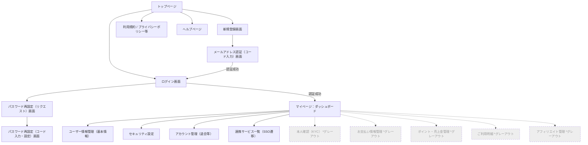

# netherid 画面設計書（画面遷移・配置項目）

## 1. 画面遷移図

---

## 2. 各画面の配置項目一覧

共通コンポーネントとして、未ログイン時は「ヘッダー（ログイン/登録ボタン）」「フッター（規約・ヘルプリンク）」を表示し、ログイン後は「サイドバー（またはヘッダーナビ）によるメニュー」を常時表示します。※メニュー内の不要機能はグレーアウトし、クリック不可とします。

### 2.1. パブリック画面（未ログイン）

#### 1. トップページ（LP）
- **ヘッダー:** ロゴ、「ログイン」ボタン、「新規登録」ボタン
- **メインビジュアル（FV）:** サービスコンセプト（「ひとつのIDで全サービスへ」等）と登録誘導ボタン
- **コンテンツエリア:** netheridの機能概要、連携サービスの一覧紹介
- **フッター:** 運営会社情報、利用規約、プライバシーポリシー、特定商取引法に基づく表記、お問い合わせフォーム、ヘルプページへのリンク

#### 2. 新規登録画面群
- **登録入力画面:** 
  - メールアドレス入力フォーム
  - パスワード入力フォーム（※Kratosの仕様に合わせ、初期パスワードをここで設定）
  - 「利用規約・プライバシーポリシーに同意する」チェックボックス
  - 「登録して認証コードを送信」ボタン
- **メールアドレス認証（コード入力）画面:**
  - メールで届いた認証コード（Verification Code）入力フォーム
  - 「認証して完了する」ボタン
  - 「認証コードを再送する」リンク

#### 3. ログイン画面
- メールアドレス入力フォーム
- パスワード入力フォーム
- 「ログインを保持する」チェックボックス
- 「ログイン」ボタン
- リンク: 「パスワードをお忘れの方はこちら」
- リンク: 「新規登録はこちら」

#### 4. パスワード再設定画面（リカバリフロー）
- **リクエスト画面:** 登録メールアドレス入力フォーム、「リカバリコードを送信」ボタン
- **リカバリコード入力・再設定画面:** 
  - メールで届いたリカバリコード（Recovery Code）入力フォーム
  - 新しいパスワード入力フォーム、確認用入力フォーム
  - 「パスワードを再設定する」ボタン

---

### 2.2. マイページ（ログイン後）

#### 1. ダッシュボード
ログイン直後に表示されるマイページのトップ画面です。
- **ウェルカムメッセージ:** 「〇〇さん、こんにちは」
- **アカウントステータス:** 登録メールアドレス、ユーザー属性（個人/法人）
- **お知らせ（通知）エリア:** 運営からの重要なお知らせやアップデート情報を表示
- **連携サービスへのショートカット:** 利用可能な各サービス（SSO遷移先）のパネル一覧
- ※ポイント残高サマリー等はグレーアウト対象のため非表示（または枠のみグレー表示）

#### 2. ユーザー情報管理（基本情報設定）
- **表示・入力項目:**
  - メールアドレス（変更用フォームへの導線）
  - 氏名（漢字・フリガナ）
  - 属性（個人 / 法人 のラジオボタン・切り替え）
  - 住所（郵便番号、都道府県、市区町村、番地、建物名）
  - 電話番号
- **アクション:** 「変更を保存する」ボタン

#### 3. セキュリティ設定
- **パスワード変更パネル:**
  - 現在のパスワード入力
  - 新しいパスワード入力 / 確認用入力
  - 「パスワードを変更する」ボタン
- **多要素認証（MFA）設定パネル:**
  - SMS認証の有効化/無効化トグル（電話番号入力とコード確認フロー）
  - 認証アプリ（2段階認証）の有効化トグル（QRコード表示、ワンタイムパスワード入力フロー）
- **ログイン履歴:**
  - 直近のログイン履歴リスト（日時、IPアドレス、デバイス情報）

#### 4. アカウント管理
- **退会（ID削除）パネル:**
  - 退会に関する注意事項・警告（「一度削除すると元に戻せません」等）
  - 「退会手続きへ進む」ボタン（クリック後に最終確認モーダル表示）

---

### 2.3. グレーアウト対象画面（※現段階ではメニュー上に非活性で表示するのみ）

画面へのアクセス自体を無効（グレーアウト）としますが、将来的な配置予定項目は以下の通りです。

- **本人確認（KYC）:** 身分証・登記簿等の画像アップロードフォーム、現在の審査ステータス表示
- **お支払い情報管理:** 登録済みクレジットカード一覧、カード追加フォーム、メインカード指定ラジオボタン
- **ポイント・売上金管理:** 現在のポイント残高表示、ポイント購入（チャージ）ボタン、ポイント増減履歴テーブル
- **ご利用明細:** 決済履歴のテーブル一覧（日付、金額、内容）、各明細の「請求書PDF・領収書PDFダウンロード」ボタン
- **アフィリエイト管理:** 紹介用アフィリエイトリンク（URL発行）、成果発生履歴テーブル、振込先口座設定フォーム
